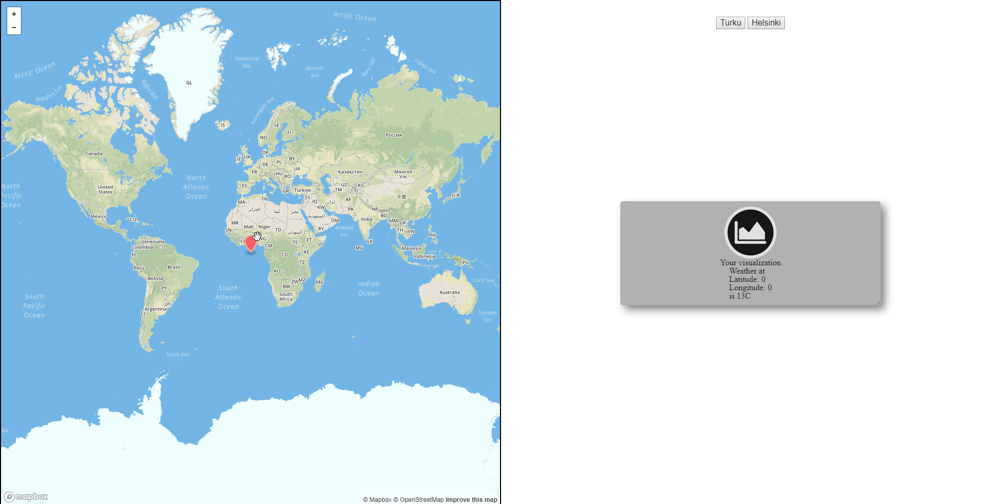

# Visit code test

You have been selected to perform a coding test for Visit Intelligence.

Your task is to build a [web component](https://developer.mozilla.org/en-US/docs/Web/Web_Components) that presents data from our weather api in UI friendly way.
You can use a framework of your choice, Angular usage would be a plus, plain javascript and html5 would work as well.

## Specification

- Weather api can be reached at https://snapshot-api.visit.fi/heliotron/weather/ with swagger documentation located at https://snapshot-api.visit.fi/heliotron/weather/docs/
- There is a limit of 20 requests per minute, be sensible with the amount of requests per day as well.
- Your component will receive options object as an `options` property of the [DOM object](https://www.w3schools.com/jsref/dom_obj_all.asp).
- `options` object has the following [type](https://www.typescriptlang.org/docs/handbook/basic-types.html):

```ts
{
    location: {
        lat: number;    // float latitude
        long: number;   // float longitude
    },
    time: {
        start: number;  // unix timestamp in ms
        stop: number;   // unix timestamp in ms
    }
}
```

For example:

```html
<your-component></your-component>
```

```js
let component = document.querySelector("your-component");
let options = {
    location: {
        lat: 60.451843432,
        long: 22.2666432423
    },
    time: {
        start: 1575244800000,
        stop: 1575849600000
    }
}
component.options = options;
```

## Requirements

- Resulting component has to register a custom element of you choice
- ES6 and HTML5 features use is advised
- Extra focus on the visual side
- Component should update whenever `options` property is changed and reflect latest state of the property
- Component should work with latest Chrome, Edge and Firefox, poor IE support will be tolerated ;)
- Component should showcase some responsive design
- Component can be a single javascript file as well as a collection of javascript/css/html5 file with single entry javascript.

## Good to have

- Usage of shadow dom
- Different views for compact and detailed presentation

## Example
Besides simple example usage code in `index.html` file, here's how usage of your component(grey placeholder on the right) could look in the production environment:


## Delivery of the test

After the example has been coded - send it directly to lauri.ruohonen@visit.fi AND
jobs@visit.fi

Project source code and distribution files may be delivered in one of the following ways

- Zipped web project including html,css,js,image files
- Shared github project

After the code has been delivered we will call the selected ones for further interviews

## Problems

If you believe that we have a problem at our end - feel free to email additional questions to
artur.oleynik@visit.fi and as CC to jobs@visit.fi.

Good luck and have fun coding!
